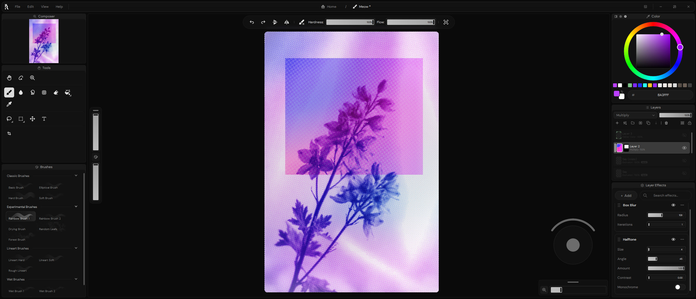

  

  <h1>Ruwa</h1>

  
<strong>A free and open-source desktop painting application for Windows.</strong>

  
Responsive drawing, customizable brushes, non-destructive editing, and a focused creative workflow.

  

    
    
    
    
    
  

  

    <a href="https://accretion.pro">Website</a>
    ·
    <a href="https://accretion.pro/download">Download</a>
    ·
    <a href="BUILDING.md">Build</a>
    ·
    <a href="CONTRIBUTING.md">Contribute</a>
    ·
    <a href="https://discord.gg/SecuUEhwPd">Discord</a>
  

Ruwa combines a responsive canvas, a customizable brush engine, layer-based
editing, and a clear interface designed to keep the creative process moving.
The complete application is available without subscriptions, paid tiers, or
locked features.

> [!IMPORTANT]
> Ruwa is alpha software under active development. Features, file formats, and
> interfaces may change before the first stable release.

## Highlights

- **Customizable brushes.** Start with an included preset or tune shape,
  texture, spacing, flow, and dynamics in the focused Brush Editor.
- **Spectral pigment mixing.** Wet brushes use Ruwa's custom pigment model for
  richer, more convincing colour mixing.
- **Non-destructive editing.** Layer effects, adjustment layers, masks, and
  transforms remain editable until you choose to bake the result.
- **An open-ended workspace.** Infinite canvas, Board Layers, reusable layouts,
  dockable panels, and configurable shortcuts keep tools and references close.
- **Tablet-oriented input.** Ruwa supports stylus workflows and includes a
  custom Windows WinTab backend.
- **Native effect plugins.** A stable C ABI lets bundled and third-party effects
  use the same public SDK and loading path.

## Project status

| | |
| --- | --- |
| Current release | `0.2.4-alpha` |
| Primary platform | Windows 10/11 x64 |
| Graphics requirement | OpenGL 4.5 |
| Technology | C++23, Qt 6, CMake |
| Source licence | MPL-2.0 |

Official Windows packages are published through
[GitHub Releases](https://github.com/LuskusDeus/Ruwa/releases) and the
[Ruwa website](https://accretion.pro/download).

## Build from source

Ruwa uses Qt 6 and CMake. The supported development workflow is to open the
top-level `CMakeLists.txt` in Qt Creator and configure it with a compatible Qt 6
toolchain.

See [BUILDING.md](BUILDING.md) for the required Qt modules, the pinned release
environment, command-line configuration, CMake options, tests, static analysis,
translations, and packaging-related build settings.

## Effect SDK

Ruwa's layer-effect system is built around a stable C ABI. Plugins compile
against the public headers under `sdk/include` without linking to Ruwa's
internal C++ implementation. The standard effects under `plugins/standard` use
the same interface as third-party plugins.

- [SDK documentation](sdk/README.md)
- [Public headers](sdk/include)
- [Reference plugin](sdk/reference)
- [Bundled standard effects](plugins/standard)

## Documentation

| Document | Contents |
| --- | --- |
| [BUILDING.md](BUILDING.md) | Toolchain, Qt Creator workflow, tests, and static analysis |
| [CONTRIBUTING.md](CONTRIBUTING.md) | Contribution workflow, coding conventions, and DCO sign-off |
| [CHANGELOG.md](CHANGELOG.md) | Version history and release notes |
| [sdk/README.md](sdk/README.md) | Native effect-plugin development |
| [docs/SECURE_UPDATES.md](docs/SECURE_UPDATES.md) | Signed update architecture and release signing |
| [RELEASE.md](RELEASE.md) | Packaging procedure and release checklist |
| [SECURITY.md](SECURITY.md) | Private vulnerability reporting |
| [GOVERNANCE.md](GOVERNANCE.md) | Project roles and decision-making |

## Contributing

Contributions are welcome. You can help by testing Ruwa, reporting reproducible
bugs, improving documentation or translations, developing effect plugins, or
contributing code.

For anything larger than a small fix, please open an issue before starting work
so the approach can be discussed first. All commits must include a Developer
Certificate of Origin sign-off; the complete process is documented in
[CONTRIBUTING.md](CONTRIBUTING.md).

Project spaces follow the [Code of Conduct](CODE_OF_CONDUCT.md). Security
vulnerabilities should be reported privately as described in
[SECURITY.md](SECURITY.md), not through public issues or Discord.

## License

Ruwa source code is licensed under the
[Mozilla Public License 2.0](LICENSE).

Bundled fonts, icons, artwork, and third-party components retain their respective
terms. See [NOTICE](NOTICE),
[THIRD_PARTY_NOTICES.md](THIRD_PARTY_NOTICES.md),
[ASSET_POLICY.md](ASSET_POLICY.md), [TRADEMARKS.md](TRADEMARKS.md), and the
[LICENSES](LICENSES) directory for details.
